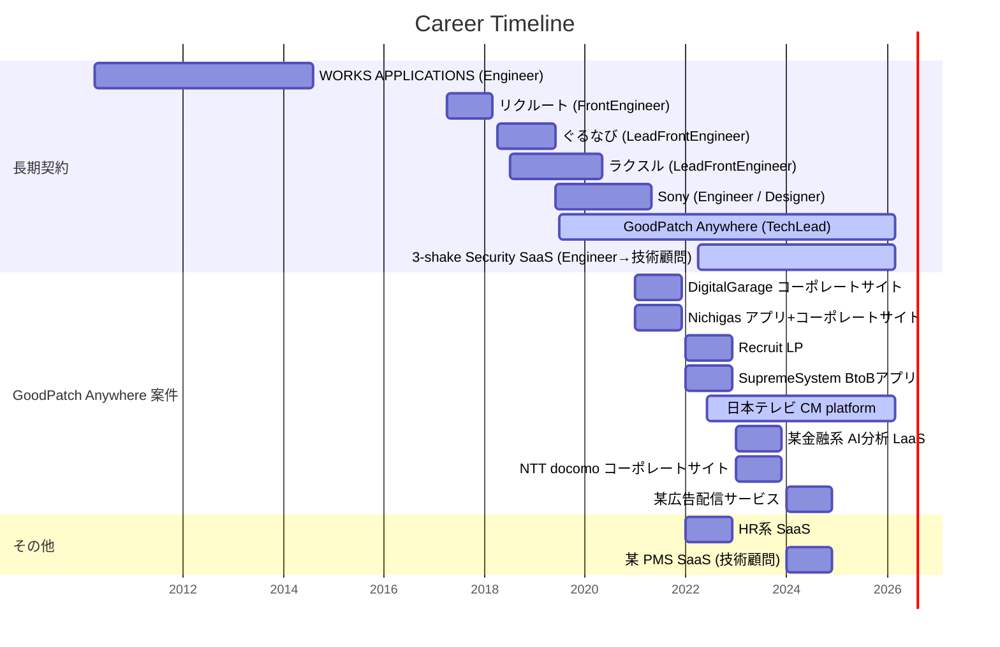

<!-- ============================================================
  GitHub Profile README — 大畠 康佑 (でび / KdavisO)
  - 各セクションに「TODO: ここを編集」コメントがあります
  - バッジは1行1つなので、行の追加・削除で簡単に編集できます
============================================================ -->

<h1>
  大畠 康佑 / Kosuke Davis Ohata / でび
</h1>

  1987.06.17 (<!-- AGE_START -->38<!-- AGE_END -->歳)
  &nbsp;
  
  
  

  フロントエンド開発が好きなWebエンジニアです。 
  マネジメントの割合が多めのお年頃です。

---

## 🧑‍💻 About Me

**🎯 テーマ: 感情や体調に左右されない開発環境の構築**

計画と自動化。シングルスレッドによる並列処理。
負荷を減らして、多面で稼働できる生活を目指しています。

2024 年から AI を活用した開発を本格的にスタートし、生産効率を大幅に向上させています。 
AI Agent との協業を前提とした開発フローの構築にも取り組んでいます。

- フロントエンド開発をコアスキルに、技術顧問・テックリード・エンジニアリングマネジメントまで対応
- 「正解・効率に拘らない」を心がけています。<strong>立場や状況でいろいろありますよね</strong>
- 終わった時に**良い案件だったと言える / 言ってもらえる**開発体験を大切にしています
- 2児の父 / 兼業主夫 / ハウスダンス歴 10年ちょっと / ロボットアニメ好き（ガンダム・マジンガーZ）
  - 「軽そうなダンス」と「暗そうなアニメ」で、印象が打ち消しあってくれるといいなぁと思っています

 
<a href="https://note.com/gp_anywhere/n/n25dc4a50c04d"><strong>エンジニアがデザイン組織で発揮する「夢を現実に落とし込む力」｜Goodpatch Anywhere｜note</strong></a>

---

## 📂 経歴 / Career

<!-- 経歴を更新する場合は、Mermaid の gantt 記法で行を追加・編集してください -->
<!-- dateFormat は YYYY-MM、終了日が現在まで続く場合は 2026-03 等の未来日を指定 -->

<strong>詳細テーブルを表示</strong>

 

| 期間 | 企業・プロジェクト | 役割 | 概要 |
| --- | --- | --- | --- |
| 2024 | 某 PMS SaaS | 技術顧問 | 内製化支援 |
| 2024 | 某広告配信サービス (gpaw) | Engineer | 広告配信サービスの開発 |
| 2022.04 - | Security 診断 SaaS (3-shake) | Engineer → 技術顧問 | Go + Firebase + Next.js でセキュリティ診断 SaaS 開発 |
| 2023 | NTT docomo (gpaw) | FrontEngineer | コーポレートサイトのフロントエンド開発 |
| 2023 | 某金融系 AI 分析 LaaS (gpaw) | Engineer | AI 分析プラットフォーム開発 |
| 2022.06 - | 日本テレビ CM platform (gpaw) | ProjectManager / Engineer | [スグリー](https://sgr-service.ntv.co.jp/) |
| 2022 | SupremeSystem (gpaw) | Engineer | BtoB アプリ開発 (Java + Vue3 + Element Plus) |
| 2022 | Recruit LP (gpaw) | Engineer | [LP 開発](https://www.recruit-productdesign.jp/) (AWS + Next.js) |
| 2022 | HR 系 SaaS | Engineer | Go + Firebase + Next.js |
| 2021 | DigitalGarage (gpaw) | Engineer | コーポレートサイト開発 (PHP + Vue.js) |
| 2021 | Nichigas (gpaw) | Engineer | アプリ + コーポレートサイト開発 (Go + AWS Lambda + Vue.js) |
| 2019.07 - | GoodPatch Anywhere | TechLead / FrontEngineer | 複数 Web 案件の技術選定・要件定義・フロントエンド実装 |
| 2019.06 - 2021.05 | Sony | Engineer / Designer | Flask + AWS でコールセンター Q&A の AI 化 |
| 2018.07 - 2020.05 | ラクスル | LeadFrontEngineer | Vue.js + Rails で複数サービス設計・開発（駅バリ広告 EC / TVCM EC / 配送 SaaS） |
| 2018.04 - 2019.06 | ぐるなび | LeadFrontEngineer | Vue.js でフロントエンド開発（管理画面 / 外国語版 / 台帳サービス） |
| 2017.04 - 2018.03 | リクルート | FrontEngineer | React + Redux によるフロントエンド開発 |
| 2010.04 - 2014.08 | WORKS APPLICATIONS | Engineer | Java 製 EC パッケージ開発と導入・保守運用 |

---

## 💼 できること / 対応可能な業務

- **AI Agent 活用開発** — AI Agent を活用した Web アプリケーション開発
- **フロントエンド開発** — React / Vue.js / Next.js / Nuxt.js を用いた SPA・SSR 開発
- **バックエンド開発** — Go / Node.js / Python / Java / Ruby on Rails による API 設計・実装
- **インフラ構築** — AWS / GCP / Firebase / Docker 環境のセットアップ
- **技術顧問・内製化支援** — 技術選定、アーキテクチャ設計、チームへの技術移管
- **エンジニアリングマネジメント** — チームビルディング、開発プロセス改善
- **テックリード** — 技術方針策定、コードレビュー、開発フロー整備
- **テックコーチング・スクラムマスター** — チーム・組織の底上げ
- **デザイン・動画制作** — Illustrator / After Effects を用いた実印刷デザイン・動画制作

